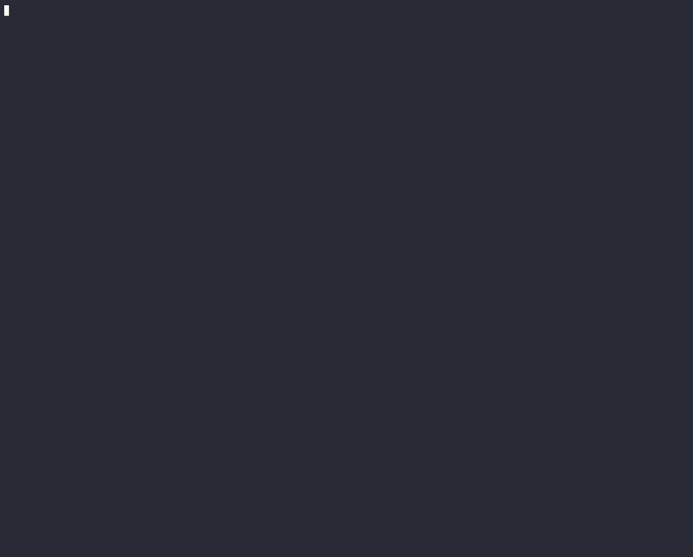

# arch-lottery

This repo contains a local arch-network development stack, as well as some one sample program(lottery).

## Requirements:
- [Rust]
- [Docker]
- [A C++ Compiler (gcc/clang)](#21-install-c-compiler)
- [Solana CLI](#22---install-solana-cli)

## Getting Started

You can find Lottery Arch Network simple smart contract in https://github.com/FCBtc1116/Arch-Lottery/tree/master/examples/raffle repo.


## Build program
If everything builds correctly, the `cargo-build-sbf` output should resemble the following:


- Submit a test arch-network transaction, executing the `Lottery` program:
```bash
# return to the Raffle dir and run test
cd .. && cargo test -- --nocapture
```
